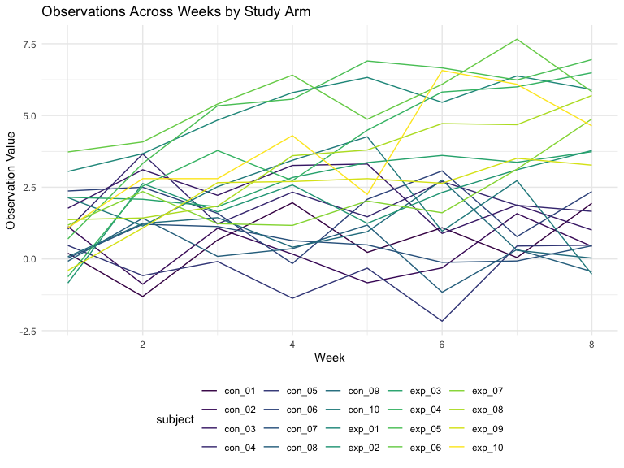
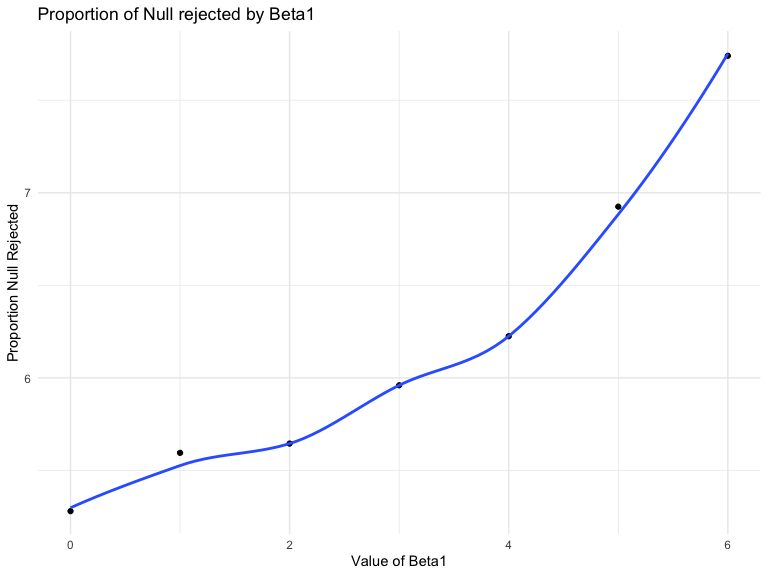
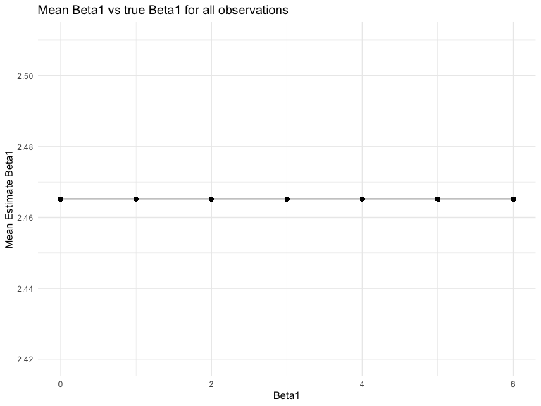
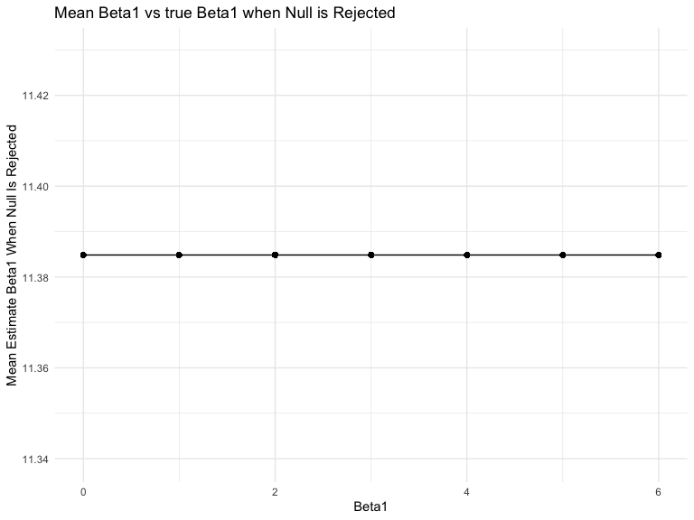

p8105\_hw5\_tb2715
================
Tess
11/5/2019

# load in iris dataset

``` r
set.seed(10)

iris_with_missing = iris %>% 
  map_df(~replace(.x, sample(1:150, 20), NA)) %>%
  mutate(Species = as.character(Species)) %>%
  janitor::clean_names()
```

# Tidy Iris Database

``` r
complete_data = function(x) {
  
   if (is.numeric(x)) {
   replace_na(x, round(mean(x, na.rm = TRUE)))
   }
   else if (is.character(x)) 
     {replace_na(x, "virginica")}
}


iris_full = map_dfr(.x = iris_with_missing, ~ complete_data(.x))

iris_full
```

    ## # A tibble: 150 x 5
    ##    sepal_length sepal_width petal_length petal_width species
    ##           <dbl>       <dbl>        <dbl>       <dbl> <chr>  
    ##  1          5.1         3.5          1.4         0.2 setosa 
    ##  2          4.9         3            1.4         0.2 setosa 
    ##  3          4.7         3.2          1.3         0.2 setosa 
    ##  4          4.6         3.1          1.5         1   setosa 
    ##  5          5           3.6          1.4         0.2 setosa 
    ##  6          5.4         3.9          1.7         0.4 setosa 
    ##  7          6           3.4          1.4         0.3 setosa 
    ##  8          5           3.4          1.5         0.2 setosa 
    ##  9          4.4         2.9          1.4         0.2 setosa 
    ## 10          4.9         3.1          4           0.1 setosa 
    ## # … with 140 more rows

In the first dataset, “iris\_with\_missing”, there is missing
petal\_width for the fourth observation. After applying a function to
the dataset there is now a value in its place that represents the mean
of all the petal\_widths. Additionally, the 22nd observation now has a
species name of virginica.

## Problem 2

# Create dataset

``` r
file_name <- list.files(path = "./data") 

import_data = function(x) {
  df = read_csv(file = str_c("./data/", x)) %>% 
    mutate(filename = x) %>% 
    separate(filename, into = c("file", "remove"), sep = "\\.") %>%
    select(-remove) %>% 
    separate(file, into = c("arm", "subject_id"), sep = "_") 
  df
}

combined_df = 
  tibble(file_name) %>% 
    mutate(data = map(file_name, import_data)) %>% 
      unnest()
```

# clean dataset for easier interpretation

``` r
clean_df =
combined_df %>% 
  pivot_longer(
    week_1:week_8,
      names_to = "week", 
      values_to = "observation"
  ) %>%
    mutate(arm = if_else(arm == "con", "Control", "Experimental"), 
          subject = str_replace(file_name, ".csv", "")) %>% 
   separate(week, into = c("header", "week"), sep = "_") %>%
    select(-header, -file_name) %>% 
    mutate(week = as.numeric(week))
```

# Spaghetti Plot

``` r
clean_df %>% 
  ggplot(aes(x = week, y = observation, color = subject)) +
  geom_line() +
  labs(
    title = "Observations Across Weeks by Study Arm",
    x = "Week",
    y = "Observation Value"
  )
```


The experimental arm, as documented by the lighter color lines in the
graph tends to have higher observation values over the course of the
study while the control arm remains fairly flat steady. Both arms start
around the same values. By week 7, all experimental values are higher
than control values.

## Question 3

``` r
sim_regression = function(n = 30, beta0 = 2, beta1 = 0, sigma_sq = 50) {
  
  sim_data = tibble(
    x = rnorm(n),
    y = beta0 + beta1 * x + rnorm(n, 0, sigma_sq)
  )
  ls_fit = lm(y ~ x, data = sim_data) %>% 
    broom::tidy() %>%
    select(-std.error, -statistic)}

sim_results = 
  tibble(beta1 = 0:6) %>% 
  mutate(
    output_lists = map(.x = beta1, ~rerun(10000, sim_regression(beta1 = .x))),
    estimate_dfs = map(output_lists, bind_rows)) %>% 
  select(-output_lists) %>% 
  unnest(estimate_dfs)
```

``` r
#proportion of times null was rejected to value of B1
sim_results %>%
  group_by(beta1) %>%
  summarize(n = n(),
            prop_sig = sum(p.value < .05)/n()*100) %>%
ggplot(aes(x = beta1, y = prop_sig)) + 
  geom_point() + 
  geom_smooth(se = FALSE) + 
  labs(x = "Value of Beta1", y = "Proportion Null Rejected", title = "Proportion of Null rejected by Beta1")
```

    ## `geom_smooth()` using method = 'loess' and formula 'y ~ x'


As the Beta1 value increases, a higher proportion of the null is
rejected. This linear increase is seen after a Beta1 value of 2.

``` r
#average estimate of beta1
all_beta1 =
sim_results %>%
  mutate(average_estimate = mean(estimate)) %>%
  ggplot(aes(x = beta1, y = average_estimate)) + 
  geom_point() + 
  geom_line() + 
  labs(x = "Beta1", y = "Mean Estimate Beta1", title = "Mean Beta1 vs true Beta1 for all observations")

all_beta1
```



``` r
#average estimate of beta1 when null is rejected
null_beta1 = 
sim_results %>%
  filter(p.value < .05) %>%
  mutate(average_estimate = mean(estimate)) %>%
  ggplot(aes(x = beta1, y = average_estimate)) + 
  geom_point() + 
  geom_line() + 
  labs(x = "Beta1", y = "Mean Estimate Beta1 When Null Is Rejected", title = "Mean Beta1 vs true Beta1 when Null is Rejected")

null_beta1
```


The average estimate of Beta1 compared to the true value of Beta 1 has a
slope of almost 0. The mean estimate seems to match the true Beta1 value
accurately.

When the null is rejected, the average beta1 estimate is much higher
than when included but it still represents the data in a 0 slope fashion
that captures the true beta1 value across the range of betas.

In comparing the beta1 when null is rejected to when it is included, the
average value is very different, signifying something worth
investigating in more detail might be occurring for the null values.
